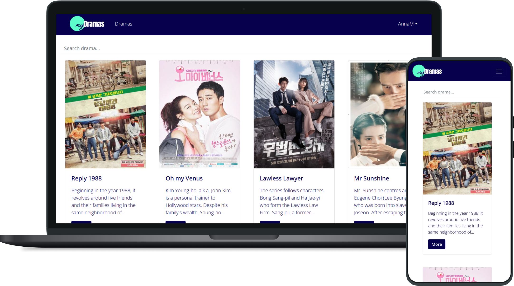

# React App (kDrama App)

&nbsp;

    

&nbsp;

Creating this App is part of my [CF Full-Stack Web Development Program](https://careerfoundry.com/en/courses/become-a-web-developer/).

Live Demo [here](https://mydrama.netlify.app/).

&nbsp;

## 📝 Objective
Using React, to build a client-side for an application called kDrama App based on its existing server-side code (REST API and database).

&nbsp;

## 🗝️ Key Features
* **Main view**
    * Returns a list of ALL Korean dramas to the user (each listed item with an image, title, and description)
    * Filtering
    * Ability to select a drama for more details
* **Single drama view**
    * Returns data (description, genre, director, image, episodes, writer) about a single drama to the user
    * Allows users to add a drama to their list of favourites
* **Login view**
    * Allows users to log in with a username and password
* **Registration view**
   * Allows new users to register (username, password, email, birthday)

* **Genre view**
    * Returns data about a genre, with a name and description

* **Director view**
    * Returns data about a director (name, bio, birth year, death year)

* **Profile view**
    * Allows users to update their user info (username, password, email, date of birth)
    * Allows existing users to deregister
    * Displays favourite dramas
    * Allows users to remove a drama from their list of favourites

&nbsp;

## 💻 Technologies Used
* Node.js 16.13.0
* React 17.0.2
